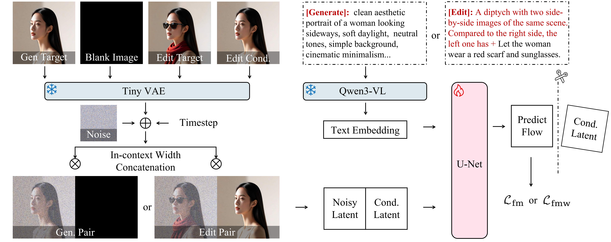

# DreamLite: A Lightweight On-Device Unified Model for Image Generation and Editing

<div align="center">


<!-- [](https://huggingface.co/ByteVisionLab/DreamLite)&nbsp; -->
[](https://huggingface.co/spaces/carlofkl/DreamLite)
[](https://arxiv.org/abs/2603.28713)&nbsp;
[](https://carlofkl.github.io/dreamlite/)&nbsp;
[](https://github.com/ByteVisionLab/DreamLite)

</div>

## 🌿 Overview

We introduce **DreamLite**, a compact and unified on-device diffusion model (**0.39B**) that seamlessly supports both **text-to-image generation** and **text-guided image editing** within a single network architecture. 

Built upon a pruned mobile U-Net backbone, DreamLite unifies multimodal conditioning through **In-Context Spatial Concatenation** directly in the latent space. By leveraging progressive step distillation, DreamLite achieves ultra-fast **4-step inference**, capable of generating or editing a **1024×1024** image in ~**3 seconds** on an iPhone 17 Pro (powered by 4-bit Qwen-VL and fp16 VAE+UNet) — operating **fully on-device with zero cloud dependency**.

<div align='center'>

</div>

<br>

<div align='center'>

<br>
<em>Figure 1. The overall unified architecture of DreamLite.</em>
</div>

---

## 📰 News

- **[2026.06]** 🎉🎉🎉 DreamLite has been merged into the official [🤗 Diffusers](https://github.com/huggingface/diffusers) library (pending the next release). You can now load and run DreamLite directly via `diffusers`.
- **[2026.06]** 🎉🎉🎉 Community contribution: [@ENUMERA8OR](https://github.com/ENUMERA8OR) released [dreamlite-comfyui-lowvram](https://github.com/ENUMERA8OR/dreamlite-comfyui-lowvram) — ComfyUI custom nodes and a low-VRAM inference pipeline that runs DreamLite-base at 1024×1024 on 4 GB GPUs.
- **[2026.04]** 🎉🎉🎉 We officially released the inference code.
<!-- and model [weights](https://huggingface.co/ByteVisionLab/DreamLite) on Hugging Face. -->
- **[2026.03]** 🎉🎉🎉 DreamLite is publicly announced! Check out our [project page](https://carlofkl.github.io/dreamlite/) and [arXiv paper](https://arxiv.org/abs/2603.28713).

---

## 🎬 On-Device Demo

Experience real-time generation and editing on an iPhone 17 Pro. No internet connection or cloud processing required.

<table align="center">
  <tr>
    <th align="center">Human Portrait & Style Transfer</th>
    <th align="center">Nature Landscape & Background Swap</th>
    <th align="center">Product & Object Replacement</th>
  </tr>
  <tr>
    <td align="center">
      <video src="assets/demo1.mp4" width="280" autoplay loop muted playsinline></video>
    </td>
    <td align="center">
      <video src="assets/demo2.mp4" width="280" autoplay loop muted playsinline></video>
    </td>
    <td align="center">
      <video src="assets/demo3.mp4" width="280" autoplay loop muted playsinline></video>
    </td>
  </tr>
</table>

> **Note**: If demos fail to render natively on GitHub, please visit our [Project Page](https://carlofkl.github.io/dreamlite/) to watch the full demonstrations.

---

## ⚙️ Getting Started

### 1. Environment Setup

```bash
# Clone the repository
git clone https://github.com/ByteVisionLab/DreamLite.git
cd DreamLite

# Create and activate a conda environment
conda create -n dreamlite python=3.10 -y
conda activate dreamlite

# Install dependencies
pip install -r requirements.txt
```

Ensure the model weights (DreamLite-base and DreamLite-mobile) are placed in the following directory structure:
```
DreamLite/
├── models/
│   ├── DreamLite-base/
│   └── DreamLite-mobile/
```

### 2. Inference via 🤗 Diffusers

DreamLite has been merged into the official [🤗 Diffusers](https://github.com/huggingface/diffusers) library. Since the change is not yet included in a stable Diffusers release, please install the latest `main` branch directly from source:

```bash
pip install git+https://github.com/huggingface/diffusers.git
```

Model weights are hosted on the **`diffusers` branch** of the following Hugging Face repos:
- [`carlofkl/DreamLite-base`](https://huggingface.co/carlofkl/DreamLite-base/tree/diffusers) (28-step, high fidelity)
- [`carlofkl/DreamLite-mobile`](https://huggingface.co/carlofkl/DreamLite-mobile/tree/diffusers) (4-step, ultra fast)

Access is currently gated — please first request access via the [Access Request Form](https://forms.gle/XLhhgxV2PUQw3vvD7). Once approved, you will receive a Hugging Face access **token** from us. Use this token to login locally:
```bash
huggingface-cli login   # paste the token we sent you when prompted
# or non-interactively:
huggingface-cli login --token <TOKEN>
```
`from_pretrained(..., revision="diffusers")` will then automatically download the weights on first use.

Alternatively, you can pre-download the weights with the CLI using the same token:
```bash
hf download carlofkl/DreamLite-base   --revision diffusers --local-dir models/DreamLite-base   --token <TOKEN>
hf download carlofkl/DreamLite-mobile --revision diffusers --local-dir models/DreamLite-mobile --token <TOKEN>
```
and then load from the local path: `DreamLitePipeline.from_pretrained("models/DreamLite-base", torch_dtype=dtype)`.

Then you can load and run DreamLite with just a few lines of code:

```python
import torch
from diffusers import DreamLitePipeline
from diffusers.utils import load_image

model_id = "carlofkl/DreamLite-base"
device = "cuda"
dtype = torch.float16

pipe = DreamLitePipeline.from_pretrained(model_id, revision="diffusers", torch_dtype=dtype)
pipe.to(device=device)

# Text-to-image
image = pipe(
    prompt="A serene mountain lake at sunrise",
    generator=torch.Generator(device=device).manual_seed(42),
).images[0]

image.save("dreamlite_t2i.png")

# Image-to-image (instruction-based edit)
image_url = "https://huggingface.co/datasets/huggingface/documentation-images/resolve/main/diffusers/astronaut.jpg"
init_image = load_image(image_url)
edited = pipe(
    prompt="make it snowy",
    image=init_image,
    generator=torch.Generator(device=device).manual_seed(42),
).images[0]

edited.save("dreamlite_i2i.png")
```

### 3. Inference via CLI
You can readily generate or edit images utilizing our provided command-line interfaces.
```bash
# ==========================================
# DreamLite-base: 28 Steps (High Fidelity)
# ==========================================
# Text-to-Image Generation
python infer.py --prompt "A close-up of a fire spitting dragon cinematic shot."

# Text-guided Image Editing
python infer.py --prompt "Transfer this image to oil-painting style." --image_path ./inputs/source.png

# ==========================================
# DreamLite-mobile: 4 Steps (Ultra Fast)
# ==========================================
# Text-to-Image Generation
python infer_mobile.py --prompt "A portrait of a young woman with flowers." 

# Text-guided Image Editing
python infer_mobile.py --prompt "Change the background to a dense forest." --image_path ./inputs/source.png
```

### 4. Benchmark Evaluation
We provide comprehensive benchmark evaluation scripts (GenEval & ImgEdit) to facilitate performance comparisons between DreamLite and other state-of-the-art models. Please configure your local dataset paths within `tools/benchmark/infer_geneval.py` and `tools/benchmark/infer_imgedit.py` prior to execution.
```bash
# Run the benchmark evaluation
python tools/benchmark/infer_geneval.py --save_dir ./output/benchmark/geneval_output --geneval_json "YOUR_GENEVAL/evaluation_metadata.jsonl"
python tools/benchmark/infer_imgedit.py --save_dir ./output/benchmark/imgedit_output --json_path "YOUR_IMGEDIT_PATH/ImgEdit/Benchmark/Basic/basic_edit.json" --img_root "YOUR_IMGEDIT_IMAGES_PATH/ImgEdit/Benchmark/singleturn"
```

<!-- ### 4. Inference via Python API (diffusers)
DreamLite is designed to be compatible with standard diffusers pipelines.
```python
import torch
from dreamlite import DreamLiteMobilePipeline
from diffusers.utils import load_image

# Load the distilled model
pipe = DreamLiteMobilePipeline.from_pretrained("ByteVisionLab/DreamLite-mobile", torch_dtype=torch.bfloat16)
pipe = pipe.to("cuda")

# Task 1: Generation
gen_img = pipe("A serene lake surrounded by mountains at sunset", num_inference_steps=4).images[0]
gen_img.save("output_gen.png")

# Task 2: Editing
source = load_image("inputs/source.png")
edit_img = pipe(prompt="Make the sky more dramatic with orange clouds", image=source, num_inference_steps=4).images[0]
edit_img.save("output_edit.png")
``` -->

### 5. Interactive Gradio Demo

We provide a user-friendly web interface powered by Gradio. You can try our live demo on Hugging Face Spaces, or deploy it locally on your own machine (GPU/CPU).

[](https://huggingface.co/spaces/carlofkl/DreamLite)

To run the interactive demo locally:
```bash
# Launch the local web server
python tools/app.py
```


## 🤗 Checkpoints
We offer two distinct variants of the DreamLite model to provide an optimal balance between visual fidelity and on-device inference latency.

> [!NOTE]
> **Model Access:** Model weights are currently undergoing safety review. To request access, please fill out our [**Access Request Form**](https://forms.gle/XLhhgxV2PUQw3vvD7).

⚠️ **Important Usage and Compliance Notice**:
By accessing and using these models, you agree to abide by our ethical guidelines. These models are for ***non-commercial, research-only*** use. You must ***NOT*** use them to generate, edit, or distribute any content that is sexually explicit, pornographic, violent, discriminatory, or otherwise illegal. Commercial use and public redistribution of the model weights are strictly prohibited.


<table>
<tr>
  <th align="left">Model Variant</th>
  <th align="center">UNet Params</th>
  <th align="center">Resolution</th>
  <th align="center">Steps</th>
  <th align="center">Guidance</th>
  <!-- <th align="center">Hugging Face Hub</th> -->
</tr>
<tr>
  <td><strong>DreamLite (Base)</strong></td>
  <td align="center">0.39B</td>
  <td align="center">1024×1024</td>
  <td align="center">28</td>
  <td align="left">CFG & IMG_CFG</td>
  <!-- <td align="center"><a href="https://huggingface.co/carlofkl/DreamLite-base">🤗 Download</a></td> -->
</tr>
<tr>
  <td><strong>DreamLite (Mobile)</strong></td>
  <td align="center">0.39B</td>
  <td align="center">1024×1024</td>
  <td align="center">4</td>
  <td align="left">No CFG</td>
  <!-- <td align="center"><a href="https://huggingface.co/carlofkl/DreamLite-mobile">🤗 Download</a></td> -->
</tr>
<tr>
  <!-- <td><strong>DreamLite-v1.1 (Mobile)</strong></td>
  <td align="center">0.39B</td>
  <td align="center">1024×1024</td>
  <td align="center">4</td>
  <td align="left">No CFG</td> -->
  <!-- <td align="center"><a href="https://huggingface.co/carlofkl/DreamLite-v1.1-mobile">🤗 Download</a></td> -->
</tr>
</table>

## 📊 Main Results

Quantitative comparison with state-of-the-art methods on generation and editing benchmarks.

<div align='center'>

<br>
<em>Text-to-Image generation comparison.</em>
</div>

<br>

<div align='center'>

<br>
<em>Text-guided image editing comparison.</em>
</div>

<br>

<table>
  <tr>
    <th>Method</th>
    <th>Params</th>
    <th>GenEval ↑</th>
    <th>DPG ↑</th>
    <th>ImgEdit ↑</th>
    <th>GEdit-EN-Q ↑</th>
  </tr>
  <tr>
    <td>FLUX.1-Dev / Kontext</td>
    <td align="center">12B</td>
    <td align="center">0.67</td>
    <td align="center">84.0</td>
    <td align="center">3.76</td>
    <td align="center">6.79</td>
  </tr>
  <tr>
    <td>BAGEL</td>
    <td align="center">7B</td>
    <td align="center">0.82</td>
    <td align="center">85.1</td>
    <td align="center">3.42</td>
    <td align="center">7.20</td>
  </tr>
  <tr>
    <td>OmniGen2</td>
    <td align="center">4B</td>
    <td align="center">0.80</td>
    <td align="center">83.6</td>
    <td align="center">3.44</td>
    <td align="center">6.79</td>
  </tr>
  <tr>
    <td>LongCat-Image / Edit</td>
    <td align="center">6B</td>
    <td align="center">0.87</td>
    <td align="center">86.6</td>
    <td align="center">4.49</td>
    <td align="center">7.55</td>
  </tr>
  <tr>
    <td>DeepGen1.0</td>
    <td align="center">2B</td>
    <td align="center">0.83</td>
    <td align="center">84.6</td>
    <td align="center">4.03</td>
    <td align="center">7.54</td>
  </tr>
  <tr>
    <td>SANA-1.6B</td>
    <td align="center">1.6B</td>
    <td align="center">0.67</td>
    <td align="center">84.8</td>
    <td align="center">-</td>
    <td align="center">-</td>
  </tr>
  <tr>
    <td>SANA-0.6B</td>
    <td align="center">0.6B</td>
    <td align="center">0.64</td>
    <td align="center">83.6</td>
    <td align="center">-</td>
    <td align="center">-</td>
  </tr>
  <tr>
    <td>SnapGen++ (small)</td>
    <td align="center">0.4B</td>
    <td align="center">0.66</td>
    <td align="center">85.2</td>
    <td align="center">-</td>
    <td align="center">-</td>
  </tr>
  <tr>
    <td>VIBE</td>
    <td align="center">1.6B</td>
    <td align="center">-</td>
    <td align="center">-</td>
    <td align="center">3.85</td>
    <td align="center">7.28</td>
  </tr>
  <tr>
    <td>EditMGT</td>
    <td align="center">0.96B</td>
    <td align="center">-</td>
    <td align="center">-</td>
    <td align="center">2.89</td>
    <td align="center">6.33</td>
  </tr>
  <tr>
    <td><strong>DreamLite (Ours)</strong></td>
    <td align="center"><strong>0.39B</strong></td>
    <td align="center"><strong>0.72</strong></td>
    <td align="center"><strong>85.8</strong></td>
    <td align="center"><strong>4.11</strong></td>
    <td align="center"><strong>6.88</strong></td>
  </tr>
</table>

## 🎛️ LoRA Fine-tuning
We provide comprehensive support for LoRA fine-tuning and inference, enabling lightweight customization of DreamLite on your own domain-specific datasets.

For detailed instructions, training scripts, and examples, please refer to our dedicated **[LoRA Fine-Tuning Guide](lora/README.md)**.

## 🎛️ On-device Deployment
We provide a complete iOS **[On-device Deployment Reference](deploy/README.md)**, including model export scripts (CoreML + mlx-vlm 4-bit quantization), modified Swift library files, and iOS app source code.

## 🌐 Community Projects
We sincerely thank the community for extending DreamLite to broader use cases and hardware. If you have built something on top of DreamLite, feel free to open a PR/Issue and we'd be happy to feature it here.

- **[dreamlite-comfyui-lowvram](https://github.com/ENUMERA8OR/dreamlite-comfyui-lowvram)** by [@ENUMERA8OR](https://github.com/ENUMERA8OR) — ComfyUI custom nodes and a low-VRAM inference pipeline that runs **DreamLite-base at 1024×1024 on a 4 GB NVIDIA GPU** (e.g., GTX 1650 Ti). It enables this through *sequential CPU offload*, *float32 precision*, and a *GQA-aware query-token attention slicing* strategy that preserves DreamLite's grouped-query attention layout (which standard Diffusers attention slicing would break). The repository also bundles ComfyUI workflows for both **DreamLite-base** and **DreamLite-mobile**, plus tiled RealESRGAN upscaling support.

## 📑 Open-Source Plan
- [X] Release paper on arXiv
- [X] Release inference code
- [X] Release LoRA training
- [ ] Release model weights on HuggingFace
- [X] Release online demo
- [X] On-device Deployment Reference


## 🙏 Acknowledgement
We thank the great work from [SDXL](https://github.com/Stability-AI/generative-models), [SnapGen](https://snap-research.github.io/snapgen/), [Qwen](https://qwen.ai/home) and [TAESDXL](https://github.com/madebyollin/taesd). The work is under supervision from Prof. Wangmeng Zuo.


## 🪪 License
**Code**: Apache-2.0

**Model weights**: see WEIGHTS_LICENSE, CC BY-NC 4.0

## 📄 Citation
If our work assists your research, feel free to give us a star ⭐ or cite us using:

```bibtex
@article{feng2026dreamlite,
  title={DreamLite: A Lightweight On-Device Unified Model for Image Generation and Editing},
  author={Kailai Feng and Yuxiang Wei and Bo Chen and Yang Pan and Hu Ye and Songwei Liu and Chenqian Yan and Yuan Gao},
  journal={arXiv preprint arXiv:2603.28713},
  year={2026}
}
```